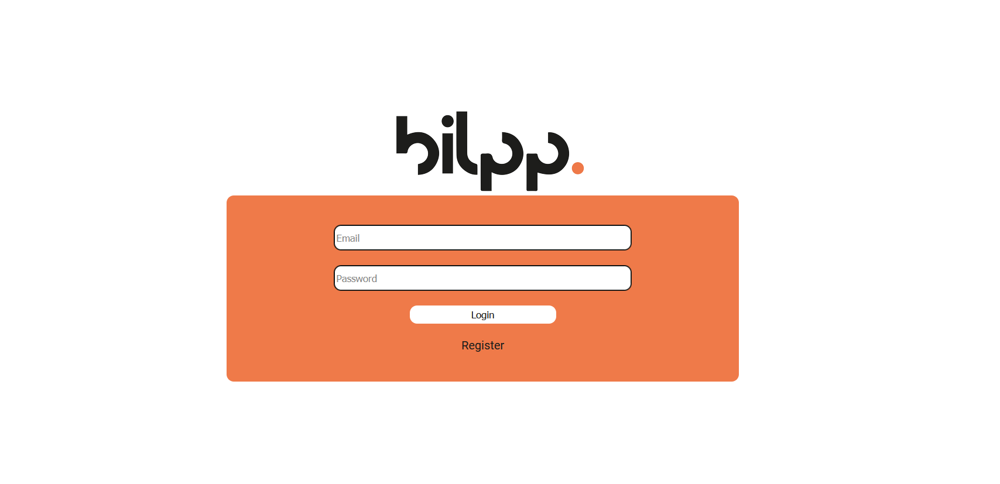

<!-- PROJECT LOGO -->
 

 
    
  

  <h3 align="center">FullStack Calendar</h3>

<!-- TABLE OF CONTENTS -->

  
About

  <ol>
    <li>
      <a href="#about-the-project">About The Project</a>
      <ul>
        <li><a href="#built-with">Built With Plain JS and ExpressJS</a></li>
      </ul>
    </li>
  </ol>

<!-- ABOUT THE PROJECT -->
## About The Project

A Calendar app for your company

* Company employees sign up
* Creates tasks with desired date, time and colors 
* Easily editable task UI :smile:

### Built With

This section should list any major frameworks that you built your project using. Leave any add-ons/plugins for the acknowledgements section. Here are a few examples.
* [ExpressJS](https://expressjs.com/)
* [VanillaJS](https://www.javascript.com/)
* [NodeJS](https://nodejs.dev/)

<!-- ACKNOWLEDGEMENTS -->
## Acknowledgements
* [Font Awesome](https://fontawesome.com)

